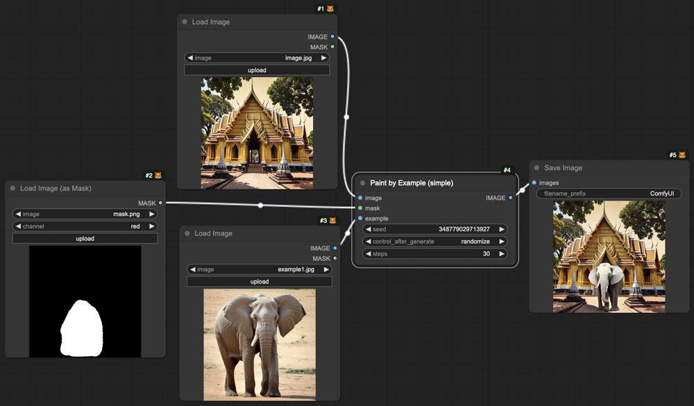
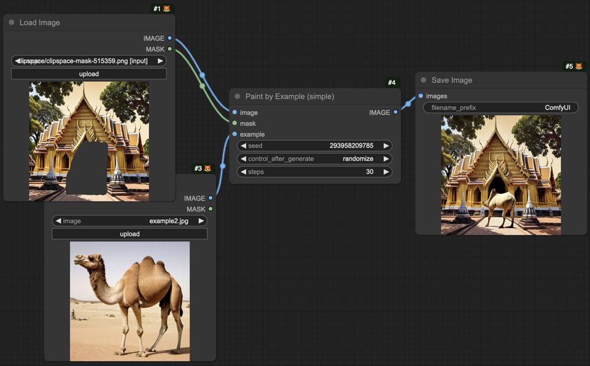
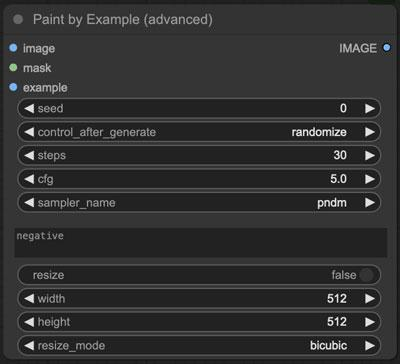
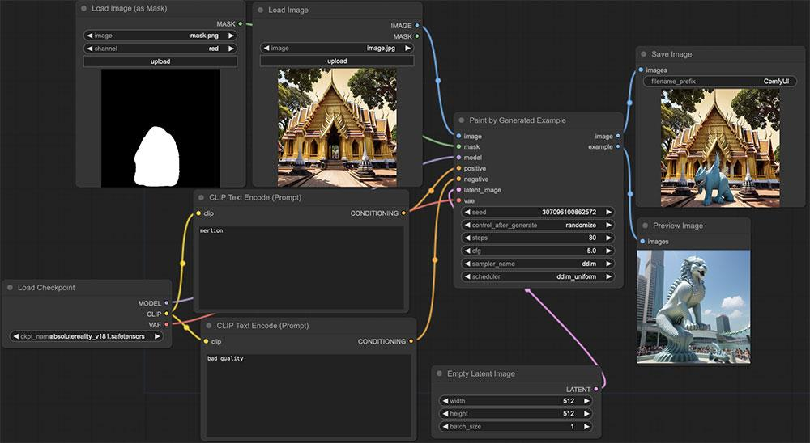

# paint-by-example_comfyui

（[english description](https://github-com.translate.goog/phyblas/paint-by-example_comfyui?_x_tr_sl=zh-CN&_x_tr_tl=en&_x_tr_hl=zh-CN)）

这个包是提供用来在comfyui执行[paint by example](https://github.com/Fantasy-Studio/Paint-by-Example)的节点。

这个方法可以把。不必须要写任何提示词。但被画的图也可能不太像例子的图。虽然如此有时候会导出很有意思的结果。

没必须要提前手动下载任何模型，但首次执行节点的时候会自动下载paint by example模型，所以要等一段时间并且会占用大于5GB的硬盘。

## install

把这个repo放在comfyui文件夹里的`./custom_nodes`就能用了。

## PaintbyExampleSimple

最简单最基本的节点。要准备原本图片和遮罩和例子图片。可以指定步数的种子。

当然也可以用maskeditor。

也支持同时生成几张。

## PaintbyExampleAdvanced

跟simple的用法差不多。只是多家了几个选项。例如可以写负面提示词。

## PaintbyExampleGen

这个节点有点复杂。是先生成图片，再拿来做例子图片。生成需要用的输入是跟一般文生图差不多。结果可以说是像一般的inpaint的。

